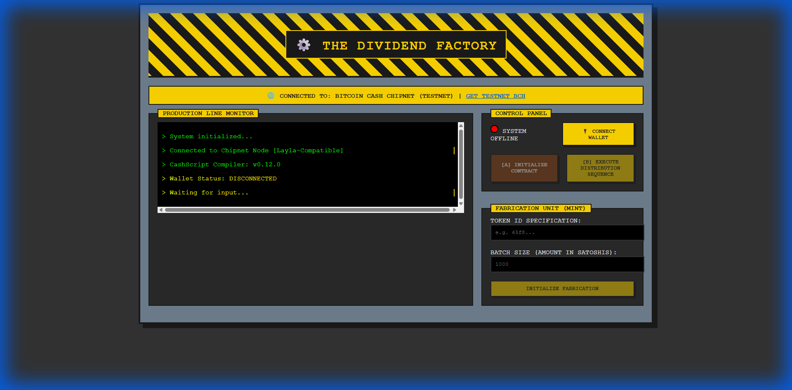
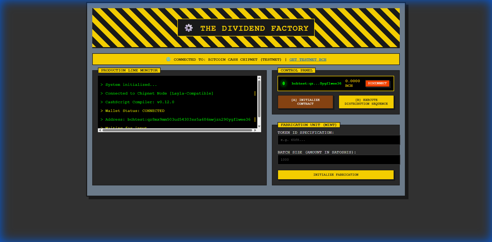

# The Dividend Factory (Chipnet Edition)

**Problem:** Sending BCH dividends to 1000 token holders usually requires 1000 transactions or complex, trusted off-chain scripts. It's inefficient and centralized.

**Solution:** We use the new **Layla Upgrade** opcodes (`OP_BEGIN`/`OP_UNTIL`) to perform native loops on-chain. This allows a single contract interaction to calculate and distribute dividends to multiple recipients in one go, enforcing logic purely through Bitcoin Cash Script.

## 🎥 Live Demo

**🌐 Live Site:** [https://the-dividend-factory-2xnpet9lz-alperens-projects-e8a4fdab.vercel.app](https://the-dividend-factory-2xnpet9lz-alperens-projects-e8a4fdab.vercel.app)

> [▶️ **Click here to watch the full high-quality demo video (.webm)**](assets/demo.webm)

## 📸 Interface Preview

<table>
  <tr>
    <td></td>
    <td></td>
  </tr>
  <tr>
    <td align="center"><b>Industrial Dashboard</b></td>
    <td align="center"><b>Wallet Connected</b></td>
  </tr>
  <tr>
    <td colspan="2"></td>
  </tr>
  <tr>
    <td colspan="2" align="center"><b>Contract Deployment Success</b></td>
  </tr>
</table>


## The Tech (Why this matters)

This isn't just a UI wrapper. We are leveraging the bleeding edge of the BCH VM:

*   **Native Loops:** Using `OP_BEGIN` and `OP_UNTIL` to iterate through recipient lists inside the locking script.
*   **Introspection:** The contract validates its own transaction outputs to ensure strict adherence to the distribution schedule.
*   **64-bit Math:** Precise dividend calculations using the new high-precision arithmetic opcodes.

## Architecture

*   **Contract:** `DividendDistributor.cash` (CashScript) - The on-chain logic engine.
*   **Frontend:** React + Vite - A "Widget Factory" themed interface for interaction.
*   **Network:** Chipnet (Testnet) - Powered by Electrum-Cash.

## Quick Start

No docker, no complex setup. Just code.

```bash
# Install dependencies
npm install

# Run the factory
npm run dev
```

## Deployment

The contract is deployed on Chipnet.
**Contract Address:** `bchtest:pq...` (Check console logs for latest deployment)

## License

MIT. Code is law.